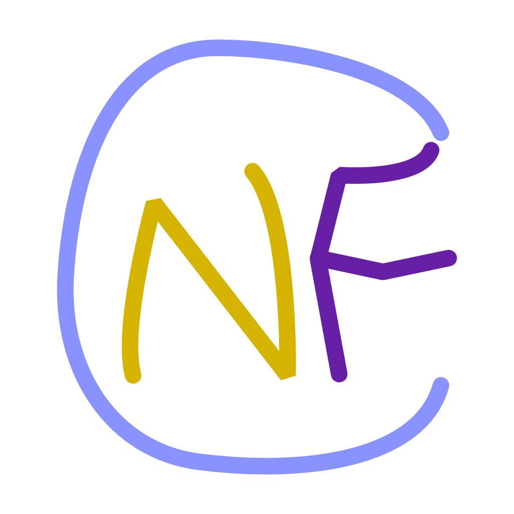

# Non-fungible Commits

NFC

## Profit

### Commit your assets

1. Clone this repository.
2. Checkout a branch and put whatever you want into the `void` directory.
3. Open a Pull Request.
4. Once over half of the contributors of this repository approved the Pull Request in 1 day, the Pull Request will be merged.
5. Once merged, you will be one of the contributors, so you can approve the follow up Pull Requests.
